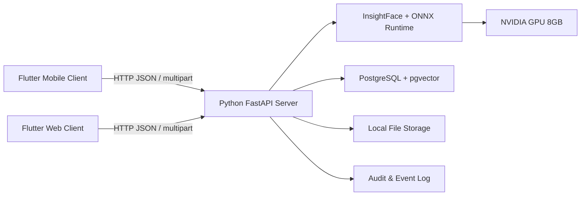

# PRD chi tiết cho hệ thống nhận diện khuôn mặt kiểm soát ra vào local-first dùng GPU NVIDIA 8GB

## Bối cảnh và mục tiêu sản phẩm

Bạn đang làm một đồ án có phạm vi rất rõ: xây dựng hệ thống nhận diện khuôn mặt dùng AI để kiểm soát ra vào, chạy **local**, tận dụng **GPU NVIDIA 8GB VRAM** có sẵn trên máy, trong đó **server là thành phần trung tâm**, còn client chỉ đóng vai trò thu nhận ảnh, hiển thị kết quả và quản trị dữ liệu. Với yêu cầu đó, kiến trúc hợp lý nhất là một hệ thống **server-side face recognition**: tất cả logic AI, truy hồi vector, đối sánh, luật nghiệp vụ và lưu trữ nằm ở Python server; Flutter chỉ làm mobile/web client giao tiếp với server qua API HTTP. Cách làm này phù hợp với FastAPI cho server API, Flutter cho web/mobile, và mô hình face analysis của InsightFace chạy trên ONNX Runtime GPU. FastAPI được thiết kế cho API hiệu năng cao, dựa trên type hints và hỗ trợ tài liệu OpenAPI tự động; Flutter hỗ trợ web và mobile; package `http` của Dart và plugin `camera` đều hỗ trợ Android, iOS và web.

Về bản chất nghiệp vụ, use case chính ở đây là **face identification 1:N**: hệ thống nhận một ảnh khuôn mặt mới, trích xuất đặc trưng, so sánh với nhiều mẫu đã đăng ký trong database, rồi trả về người khớp nhất nếu vượt ngưỡng. Theo hướng dẫn của ICO, biometric recognition hoạt động bằng cách so sánh hai tập đặc trưng sinh trắc, cho ra một **ước lượng thống kê về độ giống nhau**, chứ không phải một “sự thật tuyệt đối”; ngưỡng càng thấp thì nguy cơ chấp nhận nhầm càng cao. NIST cũng đánh giá các hệ thống face verification/recognition bằng các cặp chỉ số như FMR và FNMR ở các mức threshold cụ thể, vì vậy thiết kế API nên **trả về cả `person_id` lẫn `similarity_score` và `threshold`**, thay vì chỉ một kết quả yes/no.

Mục tiêu sản phẩm của bản PRD này là tạo ra một hệ thống v1 phục vụ demo và đánh giá kỹ thuật, với các đặc tính sau: chạy hoàn toàn cục bộ, không phụ thuộc cloud; cho phép quản lý hồ sơ người dùng với số lượng trường thông tin linh hoạt; nhận diện khuôn mặt để quyết định cho phép/không cho phép ra vào; và trả về một khóa định danh ổn định để truy hồi hồ sơ từ database. Đồng thời, vì đây là dữ liệu sinh trắc học, sản phẩm phải coi dữ liệu khuôn mặt là dữ liệu nhạy cảm, áp dụng tối thiểu hóa dữ liệu, mã hóa, giới hạn lưu giữ và phân quyền truy cập rõ ràng. Theo Ủy ban châu Âu, dữ liệu sinh trắc học dùng để định danh con người là dữ liệu nhạy cảm; ICO cũng nhấn mạnh yêu cầu bảo mật cao hơn, mã hóa và chỉ lưu dữ liệu trong thời gian cần thiết.

### Trạng thái triển khai hiện tại

Trạng thái hiện tại của dự án đã lệch khỏi bản kế hoạch ban đầu ở phần trải nghiệm client và hợp đồng API enrollment. Mobile app hiện đã có **live-camera identify**, **guided live-camera enrollment**, và People tab có thể mở chi tiết, sửa hồ sơ, xóa mềm người dùng theo quyền Admin. Enrollment không còn là luồng upload 3-5 ảnh rời rạc; app mở một phiên camera, đi qua **5 prompt cố định** gồm nhìn thẳng, quay trái, quay phải, nhìn lên/xuống và diện mạo tự nhiên. Mỗi sample enrollment gửi lên server kèm `expected_pose`, và server chỉ cho bước tiếp theo khi ảnh có đúng một khuôn mặt, đủ chất lượng và đúng pose mong đợi.

Phần đã xác minh hiện tại gồm backend tests pass, Flutter tests/analyze pass và Android release APK build pass. Phần còn mở gồm Flutter web platform folder, target-phone smoke thật, GPU/database smoke trên máy đích và full end-to-end enrollment -> identify audit trên phần cứng đích.

## Kiến trúc local-first và phân tách side

Kiến trúc đề xuất là **single-host local server** chạy trên máy có GPU NVIDIA 8GB, đóng vai trò “edge server” trong mạng nội bộ. Máy này sẽ chạy Python API server, engine AI nhận diện khuôn mặt, PostgreSQL, extension pgvector để tìm kiếm vector, và vùng lưu trữ cục bộ cho ảnh gốc hoặc ảnh audit nếu bật. Các client Flutter trên điện thoại hoặc laptop sẽ gửi ảnh qua HTTP API đến server local qua LAN hoặc cùng máy. Điều quan trọng là **client không làm inference AI**; client chỉ chụp ảnh, gửi ảnh, nhận kết quả và hiển thị. Quyết định này giúp tận dụng GPU duy nhất ở server, tránh tình trạng mỗi client phải cài model và xử lý phụ thuộc phần cứng riêng. Nền tảng này cũng phù hợp với ONNX Runtime Execution Providers, nơi CUDAExecutionProvider được dùng để tận dụng GPU NVIDIA, còn CPUExecutionProvider làm fallback.



Kiến trúc side nên được hiểu như sau. **Server-side** chịu trách nhiệm: xác thực, CRUD hồ sơ người, enrollment template khuôn mặt, nhận diện, đối sánh vector, quyết định ALLOW/DENY, ghi nhật ký, quản lý device, cấu hình threshold. **Client-side** chịu trách nhiệm: đăng nhập, camera preview, chụp ảnh, gửi request, hiển thị kết quả, tìm người theo ID, thao tác quản trị nếu có quyền. Cách phân tách này giảm đáng kể độ phức tạp của client và biến server thành nguồn chân lý duy nhất cho quyết định nhận dạng và truy hồi dữ liệu.

Có một lưu ý rất quan trọng vì bạn muốn chạy local và demo bằng điện thoại/laptop. Nếu dùng **Flutter web** với camera trong trình duyệt, thì truy cập camera yêu cầu **secure context**; theo MDN và tài liệu `camera_web`, điều này thường có nghĩa là **HTTPS**, hoặc `localhost` cho local development. Vì vậy, nếu web client chạy trên **cùng laptop với server** qua `localhost`, camera vẫn ổn; nhưng nếu bạn mở web app từ **điện thoại qua IP LAN của máy server**, bạn nên terminate API/UI bằng HTTPS cục bộ, nếu không camera trên trình duyệt có thể bị chặn. Nếu demo bằng **Flutter mobile app native**, ràng buộc secure-context của trình duyệt không còn là vấn đề chính.

Về giao tiếp HTTP, API nên dùng hai dạng payload rõ ràng. Với CRUD metadata, dùng `application/json`. Với endpoint upload ảnh nhận diện hoặc enrollment, dùng `multipart/form-data`, vì FastAPI xử lý file upload theo chuẩn này và đây là giới hạn của chính HTTP protocol chứ không phải hạn chế riêng của FastAPI. Nếu Flutter web và Python server chạy khác origin, server phải bật CORS có kiểm soát, vì trình duyệt chặn cross-origin requests nếu thiếu header phù hợp.

## Lựa chọn công nghệ và ràng buộc GPU

### Server stack được khuyến nghị

**Python + FastAPI** là lựa chọn tốt cho server v1 vì phù hợp với REST API, validation dữ liệu, tài liệu tự sinh và tốc độ phát triển nhanh. FastAPI mô tả chính mình là framework API hiện đại, nhanh, production-ready, standards-based với OpenAPI và JSON Schema; đồng thời có sẵn Swagger UI tại `/docs` và ReDoc tại `/redoc`, rất phù hợp cho demo đồ án và test API trực tiếp.

**InsightFace + ONNX Runtime GPU** là stack AI phù hợp nhất cho bài toán local inference trên NVIDIA GPU. InsightFace từ phiên bản `>=0.2` dùng `onnxruntime` làm inference backend; để bật GPU inference cần cài `onnxruntime-gpu`; ví dụ chính thức của package cũng dùng `FaceAnalysis(providers=['CUDAExecutionProvider', 'CPUExecutionProvider'])`. Điều đó rất khớp với yêu cầu của bạn: mọi inference chạy cục bộ trên GPU sẵn có, còn CPU làm đường lui khi GPU gặp lỗi.

**PostgreSQL + pgvector + JSONB** là lựa chọn database cân bằng nhất cho đồ án này. PostgreSQL `jsonb` xử lý hiệu quả hơn `json`, hỗ trợ indexing và GIN indexes để tìm kiếm key/value trong tài liệu JSON linh hoạt; còn `pgvector` cho phép lưu vector cùng với dữ liệu nghiệp vụ trong cùng PostgreSQL, hỗ trợ exact và approximate nearest neighbor search, cùng các metric như cosine distance, L2 distance và inner product. Với bài toán nhận diện khuôn mặt cần vừa lưu hồ sơ người vừa lưu embedding, đây là một mô hình rất gọn và dễ demo.

### Chọn model cho GPU 8GB

Với máy local chỉ có một GPU NVIDIA 8GB, lựa chọn model pack nên ưu tiên **inference ổn định, footprint vừa phải, chất lượng đủ cao**. Từ model zoo chính thức của InsightFace, `buffalo_l` có kích thước khoảng **326MB**, `buffalo_m` khoảng **313MB**, `buffalo_s` khoảng **159MB**; tài liệu cũng nêu `buffalo_m` có độ chính xác công bố tương đương `buffalo_l`, trong khi `buffalo_s` thấp hơn đáng kể ở các bảng accuracy. Với bối cảnh local demo trên một GPU tầm trung, **`buffalo_m` là lựa chọn mặc định khuyến nghị**: đủ nhỏ để triển khai nhẹ hơn `buffalo_l`, nhưng không phải hy sinh accuracy như `buffalo_s`. Đây là một suy luận kiến trúc hợp lý từ model pack size và accuracy công bố.

Một chi tiết quan trọng khác là **license**. Mã nguồn InsightFace Python Library mang giấy phép MIT, nhưng các **pretrained models** do họ cung cấp được ghi rõ là dành cho **non-commercial research purposes only**. Với đồ án học tập thì điều này thường không phải vấn đề, nhưng nếu sau này bạn muốn biến sản phẩm thành thương mại hoặc triển khai thật cho doanh nghiệp, bạn cần xem lại licensing của model pack hoặc chuyển sang model có quyền sử dụng thương mại phù hợp.

### Ghi chú môi trường local GPU

Đối với ONNX Runtime GPU hiện nay, tài liệu chính thức cho biết PyPI `onnxruntime-gpu` từ dòng **1.19** mặc định theo **CUDA 12.x**, và tương thích với các major version CUDA/cuDNN tương ứng; nếu đang ở môi trường CUDA 11.x thì nên pin theo line tương thích như 1.18.x hoặc theo bảng compatibility chính thức. ONNX Runtime cũng nêu rõ trên Windows cần cấu hình `PATH` cho CUDA/cuDNN binaries, còn Linux cần `LD_LIBRARY_PATH`, trừ trường hợp bạn chọn cách tích hợp đồng bộ với PyTorch để giảm cài đặt thủ công. Vì đây là local deployment, PRD nên chốt rõ một baseline environment ngay từ đầu để tránh “dependency hell”.

**Khuyến nghị baseline môi trường cho đồ án**  
Dùng một environment cố định, ví dụ:
- NVIDIA driver hoạt động ổn định.
- CUDA/cuDNN theo đúng matrix của ONNX Runtime.
- `insightface`
- `onnxruntime-gpu`
- `fastapi`
- `uvicorn`
- `opencv-python-headless`
- `psycopg`
- PostgreSQL cài `pgvector`

Với local GPU 8GB, PRD nên chọn thiết kế **một process inference chính** nạp model một lần, thay vì tách nhiều worker GPU độc lập. Đây là quyết định kiến trúc để giữ mức dùng VRAM dễ đoán và tránh nhân bản model bộ nhớ trên cùng GPU.

## PRD phía server

### Tuyên ngôn sản phẩm phía server

Server là “bộ não” của hệ thống. Server phải làm được ba việc cốt lõi: **nhận diện**, **ra quyết định**, và **truy hồi hồ sơ**. Khi client gửi ảnh lên, server phải phát hiện đúng khuôn mặt, trích xuất embedding, tìm template gần nhất trong database, đánh giá theo threshold, rồi trả về ít nhất một định danh ổn định như `person_id` để client hoặc hệ thống khác lấy hồ sơ. Vì kết quả sinh trắc học là kết quả thống kê theo threshold, server không nên trả về một boolean duy nhất; nó nên trả về cả **`matched`**, **`person_id`**, **`similarity_score`**, **`threshold`**, và **`decision`** để vừa phục vụ UI, vừa phục vụ audit. ICO nhấn mạnh rằng kết quả của biometric recognition là các phán đoán thống kê, không nên được ghi nhận như “sự thật tuyệt đối”.

### Vai trò người dùng phía server

Trong v1, server nên hỗ trợ bốn vai trò nghiệp vụ:

- **Admin**: cấu hình hệ thống, tạo/sửa/xóa người, quản lý face templates, xem logs, chỉnh threshold.
- **Operator/Guard**: dùng client để chụp ảnh nhận diện, xem kết quả cho phép/không cho phép, xem lịch sử sự kiện ở mức được phép.
- **Enrollment Operator**: đăng ký người mới, chụp ảnh enrollment, xác minh chất lượng ảnh.
- **Device Client**: mobile/web app đã đăng ký với server để gọi API nhận diện.

PRD này khuyến nghị chỉ cho **Admin** quyền xem đầy đủ hồ sơ hoặc dữ liệu debug như top-K matches. Đây cũng là cách giảm nguy cơ lộ dữ liệu không cần thiết theo tinh thần OWASP API Security 2023 về broken object property level authorization và excessive/exposed properties.

### Chức năng bắt buộc của server

Server v1 phải có các mô-đun chức năng sau:

#### Xác thực và phân quyền

Server phải có cơ chế login cho người vận hành, tốt nhất theo JWT/OAuth2 bearer flow ở mức ứng dụng nội bộ. FastAPI có tài liệu chính thức về luồng OAuth2 + JWT và tích hợp vào interactive docs, nên đây là lựa chọn phù hợp cho một hệ thống nội bộ hoặc local-first cần phân vai rõ ràng.

#### Quản lý hồ sơ người

Server phải cho phép:
- tạo người mới;
- sửa hồ sơ;
- thêm hoặc xóa trường thông tin linh hoạt;
- khóa/mở hồ sơ;
- truy vấn hồ sơ theo `person_id`;
- tìm kiếm theo tên, mã nhân sự, chức vụ hoặc metadata khác.

Vì bạn muốn “thêm bao nhiêu field cũng được”, mô hình hiện tại dùng **một phần cột chuẩn tối thiểu** gồm `employee_code`, `display_name`, `job_title`, `access_status`, và **một phần `extra_data JSONB`** cho các trường phát sinh. PostgreSQL khuyến nghị phần lớn ứng dụng nên dùng `jsonb` vì xử lý nhanh hơn và hỗ trợ indexing; GIN indexes cũng cho phép query hiệu quả trên tài liệu JSONB.

#### Enrollment khuôn mặt

Enrollment là quy trình biến một người chưa có mẫu khuôn mặt thành một người có thể được nhận diện. PRD v1 nên quy định:

- Mỗi người đi qua **5 sample enrollment** trong một phiên camera live.
- 5 prompt enrollment hiện tại là: nhìn thẳng, quay trái, quay phải, nhìn lên/xuống, và diện mạo tự nhiên.
- Server chỉ chấp nhận ảnh có **đúng một khuôn mặt**.
- Ảnh enrollment phải đạt quality check tối thiểu.
- Client gửi `expected_pose` theo prompt hiện tại; server reject sample sai pose bằng lỗi ổn định như `WRONG_POSE`.
- Client chỉ chuyển sang prompt kế tiếp sau khi server accept sample hiện tại.
- Khi sample bị reject vì `NO_FACE`, `MULTIPLE_FACES`, `LOW_QUALITY` hoặc `WRONG_POSE`, client giữ nguyên prompt và retry trong cùng phiên camera.
- Sau khi quality check đạt, server sinh ra **1 hoặc nhiều face template** và lưu vào bảng embeddings.
- Một người có thể có nhiều template active.

Việc lưu nhiều template cho cùng một người giúp hệ thống chịu được thay đổi nhẹ về góc mặt, kính, tóc, ánh sáng. Đồng thời, do accuracy của biometric references có thể giảm theo thời gian và theo thay đổi khuôn mặt, ICO khuyến nghị có quy trình **re-enrollment** phù hợp khi dữ liệu cũ không còn chính xác hoặc không còn cần thiết.

#### Nhận diện và quyết định ra vào

Đây là endpoint quan trọng nhất của toàn hệ thống. Luồng server-side được đề xuất như sau:

1. Nhận ảnh từ client qua `multipart/form-data`.
2. Kiểm tra MIME type, kích thước file và giới hạn upload.
3. Phát hiện số lượng khuôn mặt:
   - nếu 0 khuôn mặt: trả `NO_FACE`;
   - nếu >1 khuôn mặt: trả `MULTIPLE_FACES`;
   - nếu đúng 1: tiếp tục.
4. Căn chỉnh khuôn mặt và trích xuất embedding.
5. Truy vấn nearest neighbor trong bảng `face_templates`.
6. Tính `similarity_score`.
7. So sánh với `threshold`.
8. Nếu vượt threshold: trả `matched = true`, `person_id`, `face_template_id`.
9. Nếu không vượt: trả `matched = false`.
10. Ghi `recognition_event` vào log.

Ngưỡng này phải được xem là **cấu hình hệ thống**, không hardcode chết. NIST FRTE đánh giá chất lượng face recognition thông qua FNMR tại các ngưỡng được đặt để đạt một FMR nhất định; ICO cũng mô tả threshold là điểm mà hệ thống coi độ giống nhau là đủ có ý nghĩa thống kê. Vì thế PRD phải coi threshold là một phần cấu hình vận hành, có thể hiệu chỉnh bằng validation set nội bộ thay vì cố định từ đầu.

#### Truy hồi hồ sơ theo ID

Sau khi match thành công, server phải có khả năng trả về **khóa định danh ổn định** dùng để truy hồi hồ sơ. Định danh khuyến nghị là `person_id` dạng UUID. Ngoài ra, nên trả thêm `face_template_id` để audit template nào đã match, và `event_id` để lần vết sự kiện nhận diện.

Ở tầng API, bạn có hai cách:
- hoặc trả trực tiếp `person_summary` tối thiểu;
- hoặc trả `person_id` và client gọi tiếp `/v1/people/{person_id}`.

PRD v1 nên chọn cách dung hòa: endpoint nhận diện trả một **summary tối thiểu** gồm `person_id`, `display_name`, `job_title`, `access_status`; dữ liệu đầy đủ hơn chỉ được lấy qua endpoint riêng có phân quyền. Điều này giúp giảm lộ dữ liệu quá mức.

#### Lịch sử sự kiện và audit

Server phải ghi lại:
- thời gian nhận diện;
- client/device nào gửi lên;
- kết quả match hay không;
- người nào được match;
- score, threshold, decision;
- ảnh probe có được lưu hay không;
- lý do từ chối nếu có.

Do biometric probe là dữ liệu nhạy cảm, PRD nên mặc định **không lưu ảnh probe lâu dài**, hoặc chỉ lưu theo chế độ audit có thời hạn ngắn. ICO nhấn mạnh nguyên tắc data minimisation và storage limitation: càng thu và lưu ít dữ liệu thì càng ít dữ liệu cần bảo vệ; họ cũng nêu ví dụ có thể xử lý probe tạm thời rồi xóa ngay khi việc so sánh không đạt ngưỡng.

### Yêu cầu phi chức năng cho server

Server v1 nên đáp ứng các mục tiêu sau như **product targets** cho đồ án:

- **Local only**: không phụ thuộc Internet sau khi cài model và dependencies.
- **GPU-first inference**: dùng NVIDIA GPU 8GB làm đường chạy chính; CPU là fallback.
- **Độ trễ**: mục tiêu p95 dưới 1.5 giây cho một ảnh đơn, trong điều kiện local LAN, một khuôn mặt, database cỡ demo.
- **Tính nhất quán**: cùng một khuôn mặt trong điều kiện tốt phải cho kết quả ổn định qua nhiều lần thử.
- **Khả năng audit**: mọi quyết định ALLOW/DENY đều trace được tới event log.
- **Khả năng mở rộng dữ liệu hồ sơ**: thêm field mới mà không phải đổi schema mỗi lần.
- **Khả năng thay model**: model_version phải được lưu trong template để sau này có thể re-index.

### Tổ chức service nội bộ phía server

Server nên chia thành các service bên trong cùng một codebase:

- **API Layer**: FastAPI routers, auth, validation, OpenAPI docs.
- **Recognition Service**: load model, detect face, extract embedding, compare.
- **Enrollment Service**: quality check, template creation, re-enrollment.
- **People Service**: CRUD hồ sơ người.
- **Event Service**: ghi lịch sử và truy vấn audit.
- **Storage Service**: quản lý local file storage cho ảnh enrollment/audit.
- **Config Service**: threshold, retention, allowed devices, allowed origins.

Các tác vụ nhỏ như ghi log, dọn file, tạo thumbnail có thể dùng `BackgroundTasks`; FastAPI ghi rõ BackgroundTasks phù hợp cho các tác vụ nhỏ sau khi response trả về, còn các tác vụ nền nặng hơn thì nên dùng queue lớn hơn như Celery. Với đồ án local một máy và GPU hạn chế, PRD v1 nên giữ inference là synchronous trong request chính, còn background chỉ dùng cho log và housekeeping.

## PRD phía client

### Vai trò của client trong kiến trúc này

Client không phải là nơi “nhận diện khuôn mặt”, mà là nơi **capture và orchestration UI**. Flutter client chịu trách nhiệm:
- đăng nhập;
- chọn camera;
- mở live camera preview;
- chụp ảnh từ camera live;
- gửi ảnh tới server;
- hiển thị kết quả match / no match;
- hiển thị card thông tin người được nhận diện;
- cho phép admin thao tác CRUD hồ sơ nếu đăng nhập đúng vai trò.

Điểm mạnh của Flutter ở đây là một codebase có thể chạy trên mobile lẫn web, và package networking/camera chính thức đều đã hỗ trợ các nền tảng này.

### Phân loại client trong v1

PRD nên tách client thành hai mode, dù vẫn có thể nằm trong một codebase Flutter:

#### Capture client

Đây là màn hình vận hành chính cho bảo vệ hoặc người kiểm soát cửa:
- mở một phiên live camera;
- căn khung mặt;
- chụp ảnh;
- gửi tới `/v1/recognitions/identify`;
- hiển thị trạng thái:
  - Match thành công;
  - Chưa đăng ký;
  - Không có khuôn mặt;
  - Nhiều khuôn mặt;
  - Chất lượng ảnh kém;
  - Lỗi hệ thống.

#### Admin client

Đây là màn hình dành cho quản trị:
- tạo hồ sơ người;
- thêm trường dữ liệu;
- enrollment khuôn mặt bằng live camera guided flow;
- xem danh sách template;
- xem log nhận diện;
- điều chỉnh threshold;
- xuất dữ liệu.

### Yêu cầu UX chính của client

Client v1 nên ưu tiên cảm giác “ít thao tác”:
- với nhận diện: mở live camera, bấm check face, xem kết quả;
- với enrollment: một phiên live camera, 5 prompt tuần tự, rõ số sample còn thiếu;
- với enrollment bị reject: hiển thị lý do dễ hiểu và retry cùng prompt, không tự nhảy bước;
- với log: lọc theo ngày, theo người, theo device;
- với lỗi: hiển thị thông báo dễ hiểu, không lộ stack trace hay lỗi nội bộ.

PRD cũng nên quy định rằng các trường như tuổi/giới tính **không được tự động suy luận từ model để ghi đè hồ sơ chuẩn**, dù model pack có module attributes. Lý do là các kết quả biometric và suy luận từ ảnh đều có tính xác suất và là dữ liệu nhạy cảm; dữ liệu profile gốc nên do người quản trị nhập hoặc xác minh, không nên lấy trực tiếp từ dự đoán AI để làm thông tin hồ sơ mặc định. ICO nhấn mạnh rằng quyết định và đầu ra biometric không nên bị hiểu như “fact” nếu bản chất của chúng là ước lượng thống kê.

### Quyết định demo thực tế cho local environment

Với bối cảnh local GPU, có ba cách demo thực dụng nhất:

- **Khuyến nghị mạnh nhất**: chạy **Flutter mobile app** trên điện thoại và gọi API tới máy server qua LAN. Cách này tránh được hạn chế secure-context của browser.
- **Khuyến nghị thứ hai**: chạy **Flutter web** trên chính laptop server qua `localhost`.
- **Ít khuyến nghị hơn nhưng vẫn được**: chạy Flutter web trên thiết bị khác qua LAN IP, nhưng cần HTTPS cục bộ và CORS chuẩn.

Nếu mục tiêu của bạn là demo ổn định nhất cho đồ án, PRD nên xác định **primary demo path = mobile Flutter app + local Python server + LAN**, còn web là secondary demo path để chứng minh khả năng cross-platform.

## Mô hình dữ liệu và API HTTP

### Mô hình dữ liệu

PRD đề xuất dữ liệu theo các bảng cốt lõi sau.

#### Bảng `people`

Đây là bảng thực thể người:

| Trường | Kiểu | Mục đích |
|---|---|---|
| `id` | UUID | định danh chính |
| `employee_code` | text nullable | mã nhân sự / mã nội bộ |
| `display_name` | text | tên hiển thị |
| `job_title` | text | chức vụ |
| `access_status` | text | active / blocked / deleted |
| `extra_data` | JSONB | trường linh hoạt do admin tự thêm |
| `created_at` | timestamptz | audit |
| `updated_at` | timestamptz | audit |

Thiết kế này vừa giữ được các cột phổ biến để query đơn giản, vừa thỏa yêu cầu “muốn add bao nhiêu field cũng được” thông qua `extra_data JSONB`. PostgreSQL ghi rõ `jsonb` phù hợp hơn `json` cho đa số ứng dụng vì hiệu quả xử lý tốt hơn và hỗ trợ indexing.

#### Bảng `face_templates`

Đây là bảng template sinh trắc:

| Trường | Kiểu | Mục đích |
|---|---|---|
| `id` | UUID | định danh template |
| `person_id` | UUID FK | liên kết tới người |
| `embedding` | vector(512) | vector khuôn mặt |
| `model_pack` | text | ví dụ `buffalo_m` |
| `model_version` | text | version model / pipeline |
| `quality_score` | numeric | điểm chất lượng ảnh enrollment |
| `source_image_path` | text nullable | nếu lưu ảnh nguồn |
| `is_primary` | boolean | template chính |
| `is_active` | boolean | có dùng để match hay không |
| `created_at` | timestamptz | audit |

Ở đây `vector(512)` là giả định hợp lý cho v1 nếu bạn dùng ArcFace-style embedding; bài báo ArcFace mô tả embedding dimension `d=512`, còn InsightFace hỗ trợ các phương pháp ArcFace/SubCenter ArcFace trong pipeline nhận diện. Nếu sau này model đầu ra dimension khác, schema chỉ cần đổi cho đúng output thực tế của model bạn chốt triển khai.

#### Bảng `recognition_events`

| Trường | Kiểu | Mục đích |
|---|---|---|
| `id` | UUID | định danh event |
| `device_id` | UUID nullable | client gửi ảnh |
| `matched` | boolean | match hay không |
| `person_id` | UUID nullable | người được match |
| `face_template_id` | UUID nullable | template trúng |
| `similarity_score` | numeric | điểm giống |
| `threshold` | numeric | ngưỡng tại thời điểm đó |
| `decision` | text | ALLOW / DENY / REVIEW |
| `failure_reason` | text nullable | NO_FACE / MULTIPLE_FACES / LOW_SCORE... |
| `probe_image_path` | text nullable | chỉ nếu bật audit retention |
| `meta` | JSONB | camera, device info, lighting notes... |
| `created_at` | timestamptz | thời gian sự kiện |

### API HTTP chính

PRD đề xuất bộ API tối thiểu sau.

#### Auth và hệ thống

| Method | Endpoint | Mục đích |
|---|---|---|
| `POST` | `/v1/auth/login` | đăng nhập, trả JWT |
| `GET` | `/v1/server/health` | health check |
| `GET` | `/v1/server/info` | trạng thái model, GPU, version |
| `GET` | `/v1/config` | lấy config client cần biết |

#### Quản lý người

| Method | Endpoint | Mục đích |
|---|---|---|
| `POST` | `/v1/people` | tạo người mới |
| `GET` | `/v1/people/{person_id}` | lấy hồ sơ |
| `PATCH` | `/v1/people/{person_id}` | sửa hồ sơ |
| `DELETE` | `/v1/people/{person_id}` | soft delete |
| `GET` | `/v1/people` | tìm kiếm danh sách |

#### Enrollment khuôn mặt

| Method | Endpoint | Mục đích |
|---|---|---|
| `POST` | `/v1/faces/{person_id}/samples` | upload sample enrollment kèm `expected_pose`, sinh template nếu server accept |
| `GET` | `/v1/faces/{person_id}` | danh sách templates của một người |
| `DELETE` | `/v1/faces/{template_id}` | vô hiệu hóa template |

#### Nhận diện và log

| Method | Endpoint | Mục đích |
|---|---|---|
| `POST` | `/v1/recognitions/identify` | endpoint chính để nhận diện |
| `GET` | `/v1/recognitions/{event_id}` | xem kết quả event |
| `GET` | `/v1/events` | truy vấn log sự kiện |

### Hợp đồng của endpoint quan trọng nhất

`POST /v1/recognitions/identify`

**Request**
- `multipart/form-data`
- `file`: ảnh chụp từ live camera
- `device_id`: query parameter tùy chọn

**Response đề xuất**

```json
{
  "event_id": "6f4c6e4e-2b6f-4f06-8c8e-b14d16fbd72d",
  "matched": true,
  "decision": "ALLOW",
  "person_id": "18fe91f7-df1a-4d7f-ae30-c4f8c70f32a2",
  "face_template_id": "8d2ef25a-1dcf-43fa-bb10-31d88efa9a0e",
  "similarity_score": 0.7814,
  "threshold": 0.6200,
  "person_summary": {
    "id": "18fe91f7-df1a-4d7f-ae30-c4f8c70f32a2",
    "display_name": "Nguyen Van A",
    "job_title": "Engineer",
    "access_status": "active"
  }
}
```

Thiết kế response này thỏa đúng mong muốn của bạn: sau khi nhận diện thành công, hệ thống trả về **một ID ổn định** để truy hồi toàn bộ thông tin từ database; đồng thời trả thêm một “trọng số” ở dạng `similarity_score` để phục vụ giải thích hệ thống, log và tuning threshold. Theo cách hiểu nghiệp vụ lẫn hướng dẫn biometric recognition, đây là mô hình phản hồi đúng đắn hơn nhiều so với chỉ trả “true/false”.

`POST /v1/faces/{person_id}/samples`

**Request**
- `multipart/form-data`
- `file`: ảnh chụp từ guided live camera
- `expected_pose`: `face_forward`, `turn_left`, `turn_right`, `look_up_down`, hoặc `natural`

**Failure codes ổn định**
- `NO_FACE`
- `MULTIPLE_FACES`
- `LOW_QUALITY`
- `WRONG_POSE`
- `INVALID_PROMPT`

### Chiến lược truy vấn vector

Ở tầng database, truy vấn match nên theo nguyên tắc:
- lấy **top 1** mặc định cho luồng vận hành;
- có thể lấy **top K** cho admin/debug;
- dùng **cosine distance** hoặc inner product tùy cách normalize embedding;
- khi số lượng template tăng lên, bật **HNSW** index trong pgvector để tăng tốc approximate nearest-neighbor search.

`pgvector` hỗ trợ exact/approximate nearest-neighbor search, cosine distance và HNSW; PostgreSQL vẫn lưu toàn bộ nghiệp vụ trong cùng hệ thống, nên bạn không phải tách sang một vector DB riêng. Với đồ án local-first, đây là lợi thế lớn về đơn giản hóa triển khai.

## Bảo mật, riêng tư, vận hành và tiêu chí nghiệm thu

### Bảo mật và riêng tư

Vì hệ thống của bạn xử lý khuôn mặt để định danh người, dữ liệu này phải được coi là dữ liệu nhạy cảm. Ủy ban châu Âu liệt kê biometric data dùng để nhận diện con người vào nhóm dữ liệu “sensitive”; ICO yêu cầu mức bảo vệ cao hơn, mã hóa phù hợp, rà soát rủi ro, kiểm thử bảo mật định kỳ, và chỉ giữ dữ liệu trong thời gian thật sự cần thiết. Do đó PRD v1 nên có các yêu cầu bắt buộc sau:

- mã hóa dữ liệu nhạy cảm ở mức đĩa hoặc file storage;
- hạn chế giữ ảnh probe gốc;
- có retention policy rõ ràng;
- phân vai rõ giữa Admin và Operator;
- token auth cho client nội bộ;
- log audit cho mọi thao tác CRUD và mọi quyết định nhận diện.

OWASP ASVS có thể dùng làm khung kiểm tra an toàn kỹ thuật cho web app và web service, còn OWASP API Security 2023 nhấn mạnh nguy cơ lộ hoặc sửa thuộc tính đối tượng nếu phân quyền theo field không chặt. Ngoài ra, phần upload file phải coi là dữ liệu không đáng tin cậy: cần giới hạn kích thước file, loại file, kiểm tra content-type và signature/magic bytes, bởi upload là bề mặt công kích phổ biến.

### Chống giả mạo

Nếu đây chỉ là đồ án demo, bạn có thể cho **liveness/PAD** vào mức “khuyến nghị mạnh, có thể bật sau”. Nhưng nếu muốn hệ thống thuyết phục hơn cho bài toán kiểm soát ra vào, PAD nên nằm trong roadmap gần. NIST định nghĩa presentation attack là việc đưa một vật thể hoặc đặc tính người vào hệ thống sinh trắc nhằm can thiệp chính sách hệ thống; NIST cũng đã đánh giá hiệu năng của 82 thuật toán passive PAD chạy trên ảnh 2D thông thường. Điều này cho thấy chống giả mạo không phải “nice to have”, mà là lớp bảo vệ hợp lý cho access control.

### Vận hành local và quan sát hệ thống

PRD v1 cho local deployment nên định nghĩa rõ:
- server khởi động phải preload model vào GPU;
- endpoint `/v1/server/info` phải trả model name, providers, trạng thái GPU, số template đang active;
- phải có script backup database và thư mục storage;
- khi GPU không sẵn sàng, hệ thống có thể chuyển sang CPU với cảnh báo rõ ràng.

Đối với web client khác origin, cần bật CORS allowlist có kiểm soát; đối với Flutter web dùng camera qua LAN, cần HTTPS hoặc localhost. Đây là các yêu cầu vận hành thực tế chứ không chỉ là chi tiết triển khai.

### Tiêu chí nghiệm thu của đồ án

Trạng thái hiện tại của dự án so với tiêu chí v1:

- Đã có FastAPI backend, auth/RBAC, people CRUD, enrollment API, recognition API, events/config routes.
- Đã có Flutter mobile app dùng live-camera identify qua `/v1/recognitions/identify`.
- Đã có People tab mở chi tiết, sửa hồ sơ, và xóa mềm người dùng theo quyền Admin.
- Đã có guided live-camera enrollment 5 prompt qua `/v1/faces/{person_id}/samples`.
- Đã có server-side prompt validation bằng `expected_pose`, reject wrong direction/no movement trước khi tạo template.
- Đã có PostgreSQL + pgvector schema và repository path.
- Đã có backend tests pass, Flutter tests/analyze pass, Android release APK build pass.
- Chưa xác minh target-phone smoke thật.
- Chưa xác minh PostgreSQL + pgvector setup trên máy đích.
- Chưa xác minh InsightFace/ONNX Runtime GPU smoke trên máy NVIDIA đích.
- Chưa có Flutter web platform folder.
- Chưa xác minh full end-to-end enrollment -> identify audit trên phần cứng đích.

### Kết luận định hướng triển khai

Nếu chỉ chốt một cấu hình triển khai cho đồ án này, tôi sẽ chọn:
- **Python FastAPI** cho server;
- **InsightFace + ONNX Runtime GPU** cho inference;
- **`buffalo_m`** làm model pack mặc định;
- **PostgreSQL + pgvector + JSONB** cho dữ liệu;
- **Flutter mobile** làm đường demo chính;
- **Flutter web** làm đường demo phụ trên localhost hoặc HTTPS local;
- API nhận diện trả về **`person_id` + `similarity_score` + `threshold` + `event_id`**.

Đó là cấu hình bám sát yêu cầu của bạn nhất: local-first, tận dụng GPU NVIDIA 8GB, server là trung tâm, client đa nền tảng, dữ liệu hồ sơ linh hoạt, và sau khi nhận dạng thành công có thể truy hồi ngay thông tin người từ database bằng một ID rõ ràng. Đồng thời, cấu hình này cũng phù hợp với các ràng buộc kỹ thuật hiện hành của FastAPI, Flutter, ONNX Runtime, PostgreSQL/pgvector và các nguyên tắc bảo vệ dữ liệu sinh trắc học.
